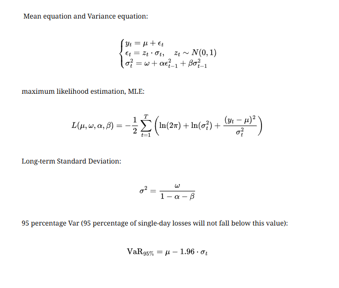

# 使用 GARCH 和 LSTM 進行波動性預測

## 專案概述

本專案實現了一個結合 GARCH(1,1) 和 LSTM 的混合模型，用於預測金融資產（如 Invesco QQQ Trust (QQQ)）的價格波動性 Conditional_Volatility(t)。GARCH.py 使用 GARCH(1,1) 模型，基於常數均值和指數收益率估計條件波動性，結合 高低價範圍 和 成交量 Z 分數 等特徵，生成 garch_data.csv 文件。GARCH-LSTM.py 使用該 CSV 文件訓練 LSTM 模型，讓模型進一步分析Conditional_Volatility, 成交量, 最高和最低價之間的非線性關係，預測下一交易日的條件波動性 Conditional_Volatility(t+1)。此方法還可以結合HV, IV, VIX等波動性指標讓投資者評估一隻股票的風險。

GARCH(1,1) 模型：

均值方程：$$ y_t = \mu + \epsilon_t, \quad \epsilon_t = z_t \cdot \sigma_t, \quad z_t \sim N(0, 1) $$
方差方程：$$ \sigma_t^2 = \omega + \alpha \epsilon_{t-1}^2 + \beta \sigma_{t-1}^2 $$

LSTM 目標：使用特徵 $ { \sigma_t, \text{HL_Range}_t, \text{Log_Volume}t, \text{Volume_ZScore}t }{t-9:t} $ 預測 $ \sigma{t+1} $。
如需英文版說明，請參見 README.md。
功能

GARCH(1,1) 波動性估計：

使用 yfinance 下載 2021-01-01 至 2025-10-11 的 QQQ 歷史股票數據（含 50 天額外數據用於滾動計算）。
計算指數收益率：$ y_t = 100 \cdot \ln(P_t / P_{t-1}) $。
計算 高低價範圍、對數成交量 和 20 天滾動 成交量 Z 分數。
擬合常數均值的 GARCH(1,1) 模型，假設正態分佈。
生成 garch_data.csv，包含欄位：Date、Returns、Conditional_Volatility、HL_Range、Log_Volume、Volume_ZScore。
可視化條件波動性 $ \sigma_t $ 和 95% VaR：$ \text{VaR}_{95%} = \mu - 1.96 \cdot \sigma_t $。

LSTM 波動性預測：

載入 garch_data.csv，準備 LSTM 訓練特徵。
訓練雙層 LSTM 模型，預測下一交易日的條件波動性 $ \sigma_{t+1} $。
支援 PyTorch 的 GPU 加速（若可用）。
可視化訓練/驗證損失及實際與預測波動性 $ \sigma_t $ 比較。
提供下一交易日的波動性預測，輔助交易決策。
