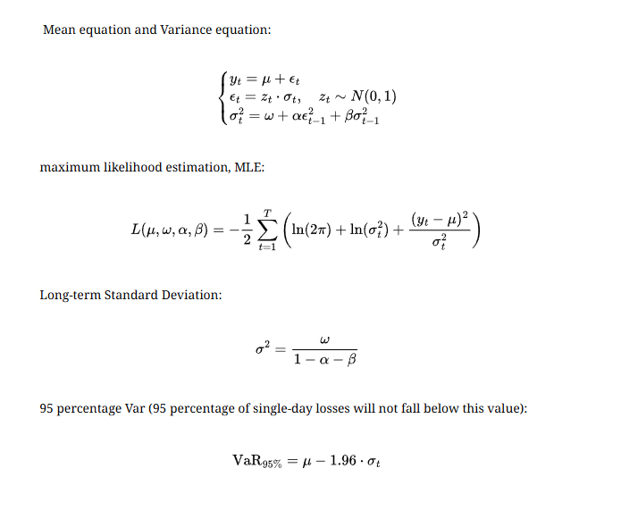

# Volatility Prediction Using GARCH and LSTM

## Project Overview

This project implements a hybrid model combining **GARCH(1,1)** and **LSTM** to predict the price volatility of financial assets, such as the Invesco QQQ Trust (QQQ), specifically the `Conditional_Volatility(t)`.

- **GARCH.py**: Uses the GARCH(1,1) model to estimate conditional volatility based on constant mean and index returns, incorporating features like high-low range and volume Z-score to generate `garch_data.csv`.
- **GARCH-LSTM.py**: Trains an LSTM model using `garch_data.csv` to analyze non-linear relationships between `Conditional_Volatility`, trading volume, and high-low price differences, predicting the next trading day's conditional volatility (`Conditional_Volatility(t+1)`). This approach can be combined with volatility indicators like HV, IV, and VIX to help investors assess stock risk. For the Chinese version, see **README.md**.

### GARCH(1,1) Model



**Visualization:**


### LSTM Model

#### 1. Input Features

The LSTM model uses a sequence of 10 days (`seq_length=10`) with five features extracted from `garch_data.csv`:

- **Returns**: Daily index percentage return, reflecting price changes relative to the previous day.
- **Conditional_Volatility**: Conditional volatility estimated by the GARCH(1,1) model, representing the asset's daily price fluctuation (in percentage).
- **HL_Range**: Difference between daily high and low prices (in index percentage), indicating price fluctuation amplitude.
- **Log_Volume**: Log-transformed daily trading volume change (in percentage), capturing relative volume changes.
- **Volume_ZScore**: Daily trading volume Z-score relative to the past 20 days, measuring volume deviation from the recent average.

These features are normalized using `MinMaxScaler` to the range [0, 1] for training stability. The input data shape is `(batch_size, seq_length=10, input_size=5)`, representing 10 days of 5 features per sample.

#### 2. Model Architecture (Customizable)

**LSTM Model Architecture:**

**LSTM Layers:**

- 2 LSTM layers (`num_layers=2`).
- Each layer has 64 hidden units (`hidden_size=64`).
- Dropout (ratio 0.2) is applied between layers to prevent overfitting.

**Fully Connected Layer:**

- Maps the last time step's LSTM output (shape `(batch_size, hidden_size)`) to a single output value.
- Outputs a single value, representing the next trading day's conditional volatility (`Conditional_Volatility(t+1)`).

**Output:** After the fully connected layer, the model outputs a scalar value representing the predicted volatility (in normalized space). This value is inverse-transformed using `MinMaxScaler` to obtain the actual volatility percentage.

#### 3. Training Process

- **Data Split**: 80% training set (first 80%) and 20% test set (last 20%).
- **Loss Function**: Mean Squared Error (MSE) to measure the difference between predicted and actual volatility.
- **Optimizer**: Adam optimizer with a learning rate of 0.001 (`learning_rate=0.001`).
- **Training Epochs**: 100 epochs (`epochs=100`) with a batch size of 32 (`batch_size=32`).
- **Hardware**: Supports GPU acceleration if available, otherwise uses CPU.
- **Loss Monitoring**: Tracks training and validation losses (using the test set as a proxy) and plots loss curves to assess convergence.

#### 4. Prediction Function

**Next Trading Day Prediction**: The `predict_next_day` function uses the trained model to predict the next trading day's `Conditional_Volatility` based on the most recent 10-day feature sequence.

#### 5. Output and Visualization

**Prediction Results**: The model generates test set predictions (`y_pred_inv`) and compares them with actual values (`y_test_inv`), computing the test set MSE.

**Visualization:**

- Line chart: Actual vs. predicted conditional volatility (X-axis: dates, Y-axis: volatility %).
- Loss curve: Training and validation loss to evaluate model stability and convergence.

The following results were obtained by training the model on Invesco QQQ Trust (QQQ) data from 2021-01-01 to 2025-10-21:


## Installation

```bash
pip install numpy pandas yfinance arch matplotlib torch sklearn
```

## Usage

1. In GARCH.py, update the ticker to the stock symbol you want to analyze (e.g., ticker = 'NVDA').
2. Specify the analysis time period (e.g., start_date = '2020-01-01', end_date = '2025-10-21').
3. Run GARCH.py.
4. Run GARCH-LSTM.py.
